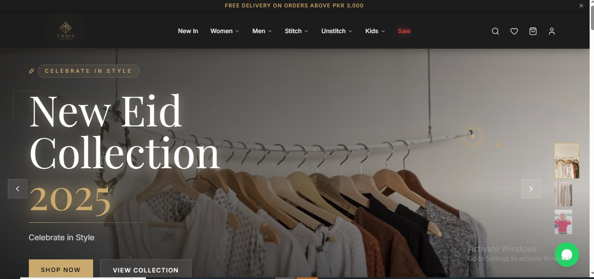
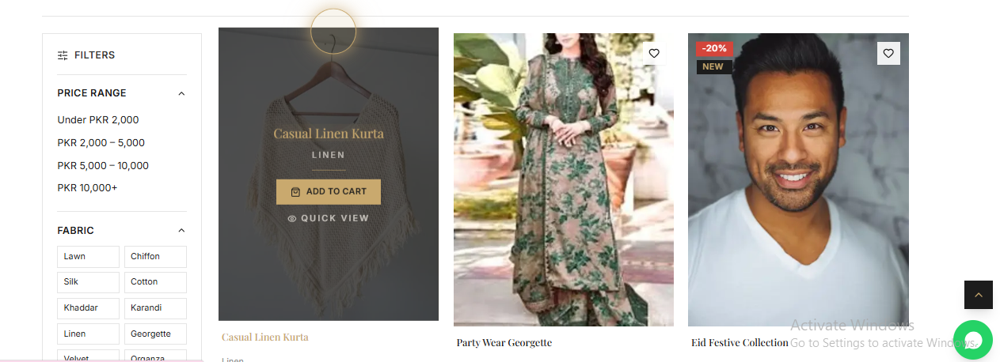
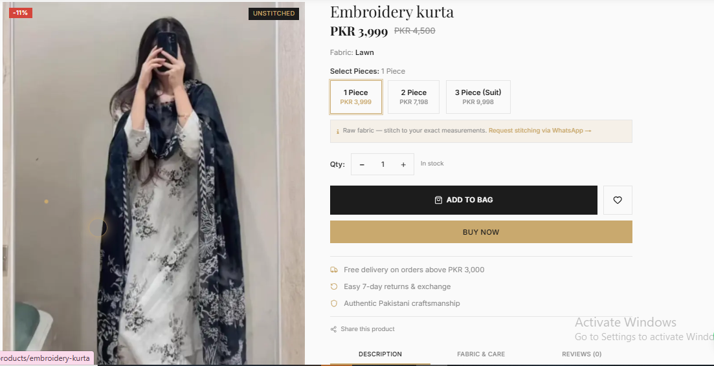
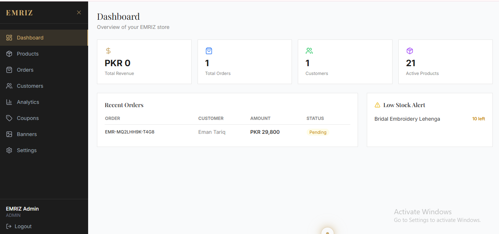
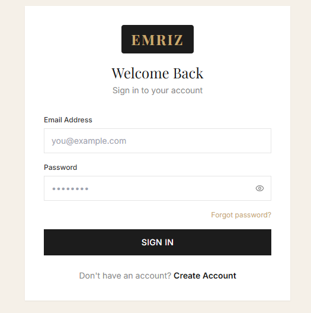

<div align="center">

# 🛍️ EMRIZ — Premium Pakistani Fashion E-Commerce

**A full-stack, production-ready e-commerce platform built for the modern Pakistani fashion market.**

[](https://emriz-fashion.netlify.app)
[](https://nextjs.org)
[](https://typescriptlang.org)
[](https://postgresql.org)

</div>

---

## 🔗 Live Links

| Page | URL |
|------|-----|
| 🏠 Homepage | [emriz-fashion.netlify.app](https://emriz-fashion.netlify.app) |
| 🛒 Products | [emriz-fashion.netlify.app/products](https://emriz-fashion.netlify.app/products) |
| 🔐 Login | [emriz-fashion.netlify.app/login](https://emriz-fashion.netlify.app/login) |
| ⚙️ Admin Panel | [emriz-fashion.netlify.app/admin](https://emriz-fashion.netlify.app/admin) |

---

## 📸 Screenshots

|  |  |  |
|---------------------|----------------------------|------------------------------------------|
|  |  | |
---

## 👩‍💻 About This Project

I built **EMRIZ** as a complete, production-grade e-commerce platform inspired by top Pakistani fashion brands like Sapphire, Khaadi, and Limelight.

The goal was to build something **real** — not just a tutorial project. That meant integrating actual Pakistani payment gateways (JazzCash & EasyPaisa), building a full admin dashboard, handling image uploads, and deploying everything live.

**What I learned:**
- Full-stack architecture with Next.js 15 App Router + Express.js REST API
- Database design with Prisma ORM and PostgreSQL
- JWT authentication with HTTP-only cookies
- Integrating third-party Pakistani payment APIs
- Docker for local development, Netlify + Railway for deployment

---

## ✨ Features

### Customer-Facing
- 🛍️ Complete product catalog (Stitch, Unstitch, Kids)
- 🔍 Advanced filtering & search
- 🛒 Shopping cart with localStorage persistence
- ❤️ Wishlist
- 📦 Multi-step checkout
- 🏷️ Coupon & discount codes
- 📍 Order tracking
- 🎯 Loyalty points system
- ⚡ Flash sale with countdown timer
- 👗 Custom stitching requests
- 👩‍👧 Mommy & Me matching section
- 📱 Fully mobile responsive

### Admin Panel
- 📊 Dashboard with analytics
- 🗂️ Product management (CRUD + Cloudinary image uploads)
- 📋 Order management
- 📧 Email notifications

### Payments
- 💚 JazzCash
- 🟢 EasyPaisa
- 💳 Stripe (International)
- 💵 Cash on Delivery
- 🏦 Bank Transfer

---

## 🛠️ Tech Stack

### Frontend
| Technology | Purpose |
|------------|---------|
| Next.js 15 (App Router) | React framework with SSR/SSG |
| TypeScript | Type safety |
| Tailwind CSS | Styling |
| Framer Motion | Animations |
| Zustand | State management |
| TanStack Query | Server state & caching |
| Shadcn/UI | UI components |

### Backend
| Technology | Purpose |
|------------|---------|
| Node.js + Express.js | REST API server |
| TypeScript | Type safety |
| Prisma ORM | Database access |
| PostgreSQL | Primary database |
| Redis | Caching & sessions |
| JWT + HTTP-only cookies | Authentication |
| Cloudinary | Image uploads |

---

## 🚀 Quick Start (Local Development)

### Prerequisites
- Node.js 20+
- Docker & Docker Compose

### 1. Clone the repository
```bash
git clone https://github.com/emaan-dev-git/emriz-fashion.git
cd emriz-fashion
```

### 2. Start the database
```bash
docker-compose up -d postgres redis
```

### 3. Setup Backend
```bash
cd backend
cp .env.example .env
# Fill in your credentials in .env

npm install
npx prisma migrate dev --name init
npx prisma generate
npm run prisma:seed    # Seeds products, coupons, admin user
npm run dev            # Runs on http://localhost:5000
```

### 4. Setup Frontend
```bash
cd frontend
cp .env.local.example .env.local
# Set NEXT_PUBLIC_API_URL=http://localhost:5000

npm install
npm run dev            # Runs on http://localhost:3000
```

---

## 📁 Project Structure

```
emriz/
├── frontend/                 # Next.js 15 App Router
│   ├── app/
│   │   ├── (store)/         # Customer-facing pages
│   │   └── (admin)/         # Admin dashboard
│   ├── components/           # Reusable UI components
│   ├── store/                # Zustand state management
│   └── lib/                  # API client, utilities
│
├── backend/                  # Express.js REST API
│   ├── src/
│   │   ├── controllers/
│   │   ├── routes/
│   │   ├── middleware/
│   │   ├── services/
│   │   └── utils/
│   └── prisma/               # Schema + migrations + seed
│
└── docker-compose.yml
```

---

## 🔌 API Reference

**Base URL:** `http://localhost:5000/api`

### Auth
| Method | Endpoint | Description |
|--------|----------|-------------|
| POST | `/auth/register` | Register new user |
| POST | `/auth/login` | Login |
| POST | `/auth/logout` | Logout |
| GET | `/auth/me` | Get current user |
| POST | `/auth/forgot-password` | Request password reset |
| POST | `/auth/reset-password` | Reset password |

### Products
| Method | Endpoint | Description |
|--------|----------|-------------|
| GET | `/products` | List products (filter, sort, paginate) |
| GET | `/products/featured` | Featured products |
| GET | `/products/new-arrivals` | New arrivals |
| GET | `/products/:slug` | Product detail |
| POST | `/products` | Create product *(Admin)* |
| PUT | `/products/:id` | Update product *(Admin)* |

### Orders
| Method | Endpoint | Description |
|--------|----------|-------------|
| POST | `/orders/create` | Place order |
| GET | `/orders` | User's orders |
| GET | `/orders/:id` | Order detail |
| PUT | `/orders/:id/cancel` | Cancel order |
| GET | `/orders/:id/track` | Track order |

---

## ☁️ Deployment

| Service | Platform |
|---------|----------|
| Frontend | Netlify |
| Backend | Railway |
| Database | Railway PostgreSQL |
| Images | Cloudinary |

---

## 📬 Contact

**Emaan Tariq**  
📧 emrizofficial.pk@gmail.com  
📍 Punjab, Pakistan  

---

<div align="center">
Built with ❤️ in Pakistan — EMRIZ Fashion 2026
</div>
